# SwarmSort

**Real-time waste detection with a YOLOv8n model whose training hyperparameters are tuned by Particle Swarm Optimization (PSO).**

Show SwarmSort a photo of waste and it draws a box around every item, names it (biodegradable, cardboard, glass, metal, paper or plastic) and tells you which bin it goes in: green for wet waste, blue for dry recyclables. Behind the demo is a controlled experiment that asks whether a hand-written swarm optimizer can train a better detector than the default settings.


<p align="center">
  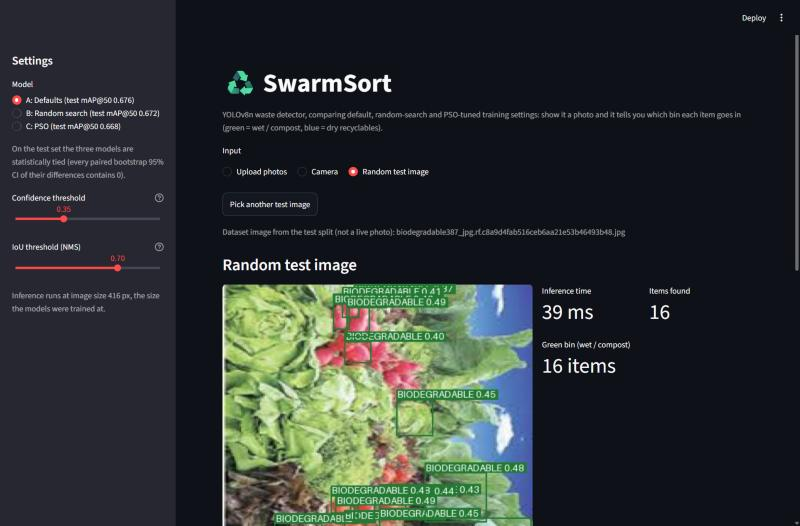
</p>

*Soft Computing course project, Semester V, Unit V: swarm intelligence.*

---

## Contents

- [At a glance](#at-a-glance)
- [Why this project](#why-this-project)
- [What we did: the experiment](#what-we-did-the-experiment)
- [How it works](#how-it-works)
- [Results](#results)
- [Demo app](#demo-app)
- [Repository structure](#repository-structure)
- [Quick start](#quick-start)
- [Reproducing the experiment](#reproducing-the-experiment)
- [Generation 2](#generation-2)
- [Limitations and future work](#limitations-and-future-work)
- [References and acknowledgements](#references-and-acknowledgements)

## At a glance

| | |
|---|---|
| **Task** | Detect and classify waste items in a photo (6 classes), then give wet/dry bin advice |
| **Model** | YOLOv8n (the smallest YOLOv8), COCO-pretrained, trained at 416×416 |
| **Soft-computing part** | A hand-written PSO (numpy only) that tunes 6 training hyperparameters |
| **Fair comparison** | A: defaults, B: random search, C: PSO; B and C each get 32 proxy trainings |
| **Best test mAP@50** | 0.676 (A), 0.672 (B), 0.668 (C), all within each other's 95% CIs |
| **Verdict** | A statistical tie: the defaults were already near-optimal for this dataset |
| **Speed** | About 31 ms per image on a laptop CPU (Intel Core Ultra 5 125H) |

## Why this project

**The problem.** India's Solid Waste Management Rules, 2016 require every household to separate its waste at source: wet (biodegradable) waste in a green bin, dry recyclables in a blue bin. In practice this is done by hand and often done badly. Food scraps soil paper and cardboard, and recyclable plastic, metal and glass end up in landfill. A camera that recognises each item and names its bin can help at home and at sorting points, but it has to be accurate and light enough for cheap hardware.

**Why hyperparameters matter.** A detector's accuracy depends not only on its architecture but on how it is trained: learning rate, momentum, weight decay and how much data augmentation it sees. These values are not learned from the data. Most projects simply keep the library defaults or pick values by hand.

**Why PSO.** All six hyperparameters we tune are continuous, and each evaluation is a full training run, so we can afford only a few dozen. PSO works directly on real-valued vectors (a move is just a vector addition), has only three main settings (w, c1, c2) with well-known values, and lets every evaluation steer the next round. It is also the swarm-intelligence method studied in Unit V.

**The gap in the base paper.** Our base paper, Majchrowska et al. (2022), detects waste with a two-stage pipeline: an EfficientDet-D2 detector finds the litter, then a separate EfficientNet-B2 classifier labels each item. Two networks run one after the other, and the hyperparameters of both are chosen by hand. SwarmSort uses a single-stage detector that finds and classifies in one pass, and tests whether a systematic search improves its hyperparameters.

| | Majchrowska et al. (2022) | SwarmSort |
|---|---|---|
| Pipeline | Two-stage: detector + classifier | Single-stage YOLOv8n |
| Hyperparameters | Chosen by hand | Tuned by PSO, compared with defaults and random search |
| Evaluation | Benchmark test sets | Untouched test split, paired bootstrap 95% CIs |
| Deployment | Not the focus | Laptop CPU, Streamlit demo with bin advice |

## What we did: the experiment

<p align="center">
  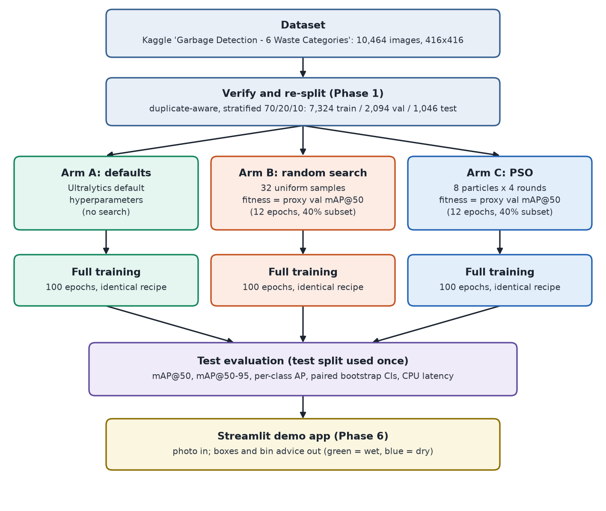
</p>

Three ways of choosing the hyperparameters, called **arms**, are compared under identical conditions:

| Arm | How the hyperparameters are chosen | Search budget |
|---|---|---|
| **A: Defaults** | Ultralytics' default values, no search | none |
| **B: Random search** | 32 uniform random samples (seed 123) | 32 proxy trainings |
| **C: PSO** | 8 particles × 4 rounds (seed 42) | 32 proxy trainings |

Random search is the standard baseline that any smarter method has to beat (Bergstra and Bengio, 2012). B and C score each candidate with the same cheap proxy training, and each winner is then trained in full with exactly the same recipe as A. Finally all three models are scored **once** on a held-out test split. Since only the six hyperparameters differ, any difference in test accuracy comes from the search method.

## How it works

### 1. Dataset and the re-split discovery

We use the Kaggle dataset [Garbage Detection – 6 Waste Categories](https://www.kaggle.com/datasets/viswaprakash1990/garbage-detection) (CC BY 4.0): 10,464 images of 416×416 pixels with YOLO bounding boxes in 6 classes.

Our first verification run showed that the dataset's own train/valid/test folders are **split by class**: valid has no paper or plastic images, and test has no glass, biodegradable or cardboard images. A model tuned and scored on such a split would only be judged on the classes that happen to be present. So all images were pooled and re-split 70/20/10, stratified by class (seed 42): **7,324 train, 2,094 val and 1,046 test images**. The split is stored in [configs/split.csv](configs/split.csv), and the dataset files are never modified.

<p align="center">
  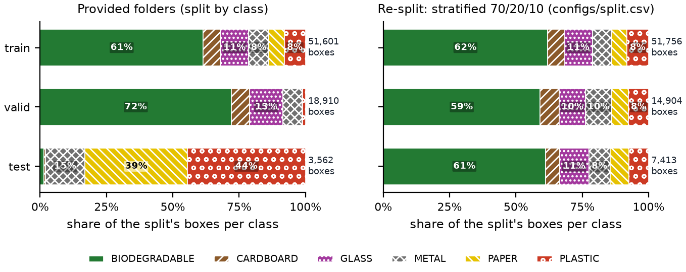
</p>

The re-split is also **duplicate-aware**: copies of the same photo are kept in the same split, so nothing leaks from train into test. Two images count as copies if they have the same bytes, come from the same Roboflow source image, have 256-bit dHashes at most 10 bits apart, or have dHashes at most 40 bits apart and 64×64 grayscale thumbnails with a Pearson correlation of at least 0.90. The rules found 138 near-duplicate pairs in 47 groups (133 images), and after the split 0.00% of val and test images have a copy in another split. All automated quality checks in [results/dataset_report.json](results/dataset_report.json) pass.

### 2. The detector: YOLOv8n

YOLOv8n is a single-stage detector: one pass over the image predicts boxes and class scores at three scales (52×52, 26×26 and 13×13 grids at 416×416 input). It starts from COCO-pretrained weights. Detections are scored with mAP@50 (mean average precision at IoU 0.5) and mAP@50-95 (averaged over IoU 0.50 to 0.95).

<details>
<summary>YOLOv8n architecture diagram</summary>

<p align="center">
  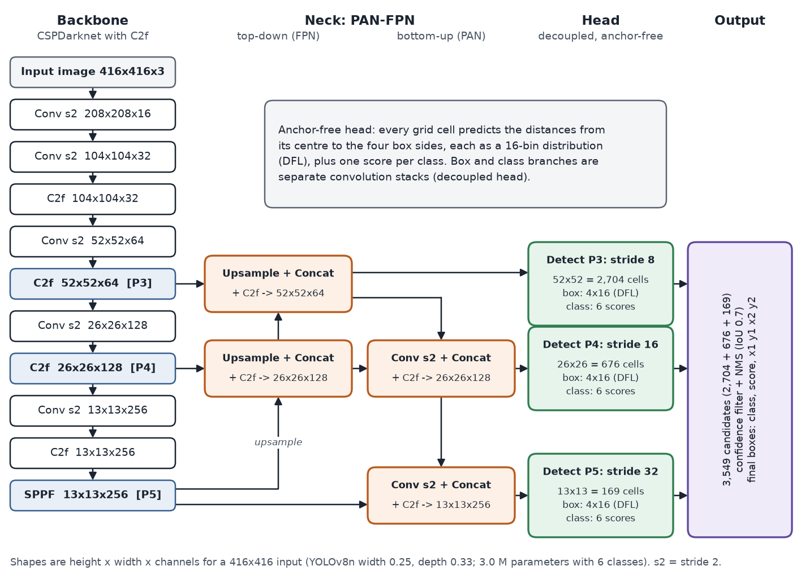
</p>
</details>

### 3. The search space

Six training hyperparameters are searched. The learning rate and weight decay span two orders of magnitude, so they are searched on a log10 scale (a particle coordinate of −3.2 means lr0 = 10^−3.2). Both search arms use exactly these bounds ([src/search_space.py](src/search_space.py)).

| Hyperparameter | What it controls | Range | Scale | Default (Arm A) |
|---|---|---|---|---|
| `lr0` | initial learning rate | 1e-4 to 1e-2 | log10 | 0.01 |
| `lrf` | final learning rate as a fraction of `lr0` | 0.01 to 0.2 | linear | 0.01 |
| `momentum` | SGD momentum | 0.60 to 0.98 | linear | 0.937 |
| `weight_decay` | L2 weight decay | 1e-5 to 1e-3 | log10 | 0.0005 |
| `mosaic` | probability of mosaic augmentation | 0 to 1 | linear | 1.0 |
| `scale` | random scaling gain | 0.2 to 0.8 | linear | 0.5 |

### 4. Particle Swarm Optimization

[src/pso.py](src/pso.py) is a hand-written, standard inertia-weight PSO (about 70 lines, numpy only). Each particle is one hyperparameter vector. It remembers the best position it has visited (**pbest**), and the swarm remembers the best position any particle has visited (**gbest**). Every update step moves each particle like this:

```
v = w*v + c1*r1*(pbest - x) + c2*r2*(gbest - x)     # inertia + pull to own best + pull to swarm best
x = x + v
```

| Setting | Value |
|---|---|
| Swarm size × rounds | 8 × 4 = 32 evaluations (round 1 is the random initial swarm, then 3 moves) |
| `c1`, `c2` | 1.5, 1.5 |
| Inertia `w` | falls linearly from 0.9 to 0.4 (0.9, 0.65, 0.4) |
| `r1`, `r2` | uniform on [0, 1], fresh for every particle and dimension |
| Velocity limit | ±20% of each dimension's range |
| Initial state | positions uniform in the bounds, velocities uniform in ±10% of the range |
| Boundaries | positions clipped to the bounds; a clipped dimension's velocity is set to 0 |
| Seed | 42 (a seeded generator makes every run repeatable) |

The optimizer has an **ask/tell** interface: `ask()` returns the positions to evaluate and `tell(fitnesses)` updates pbest/gbest and moves the swarm. It never trains a model itself, so the same class runs the benchmark functions and the real search. Before it was trusted with expensive trainings, it was checked on the 6-D Sphere and Rastrigin functions ([results/plots/pso_benchmarks.png](results/plots/pso_benchmarks.png)).

<details>
<summary>PSO flowchart</summary>

<p align="center">
  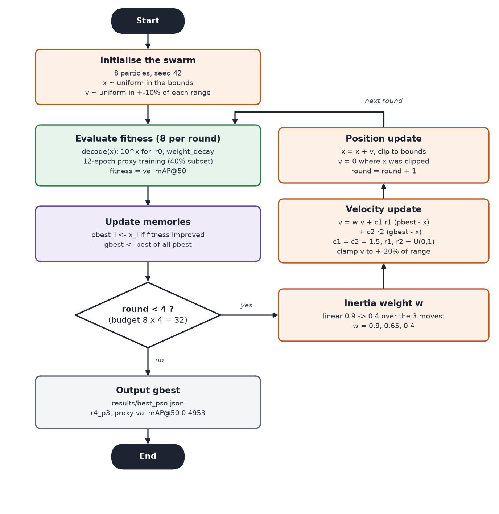
</p>
</details>

The figure below shows the real search data in the lr0–momentum plane. Left: the PSO swarm, with arrows joining each particle's successive positions; it closes in on one region round by round. Right: the 32 random-search samples, shaded by fitness.

<p align="center">
  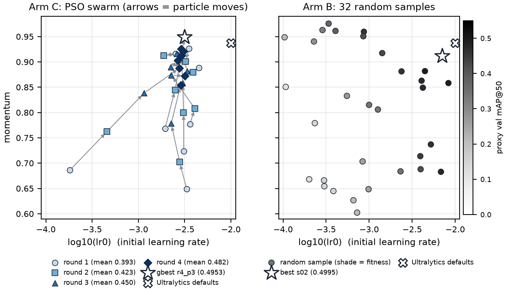
</p>

### 5. Proxy fitness and its validation

A full training takes more than an hour on a Kaggle Tesla T4, so 64 of them would be far too expensive. Each candidate is instead scored with a **proxy training**: 12 epochs on a stratified 40% subset of the train split at imgsz 416. Its fitness is the mAP@50 on the full validation split.

<p align="center">
  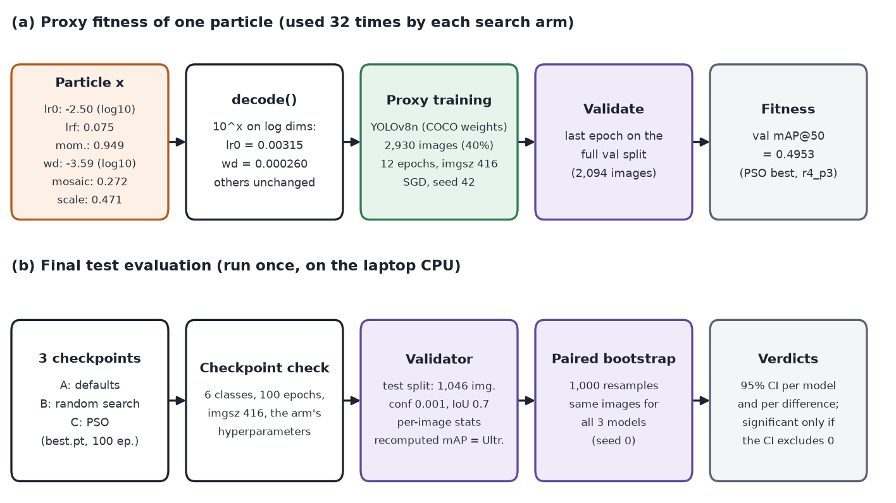
</p>

A proxy is only useful if it ranks candidates the same way a longer training does, so this was tested before any search. Seven Latin-hypercube configurations plus the defaults were each trained twice: as a proxy and as a 40-epoch run on the full train split. The rule, fixed in advance, was to accept the proxy if the Spearman rank correlation is at least 0.6. The result was **ρ = 0.976** (n = 8), so the 12-epoch proxy was accepted ([results/proxy_check.json](results/proxy_check.json)).

### 6. Full training recipe

Every full training (A, and the winners of B and C) uses the same recipe; only the six searched values differ:

- 100 epochs, imgsz 416, batch 16, pretrained `yolov8n.pt`
- explicit SGD, seed 42, deterministic mode
- warmup 3 epochs and mosaic closed for the last 10 epochs (both scale with the number of epochs, so proxy and full runs follow the same schedule)

Two Ultralytics defaults are avoided on purpose: `optimizer=auto` ignores `lr0` and `momentum` (which would make the search pointless), and `fraction` keeps the first N sorted images instead of a random sample.

### 7. Test evaluation with a paired bootstrap

The test split was used **exactly once**, for the final comparison; the searches and all checks used only train and val. [src/evaluate.py](src/evaluate.py) first checks every checkpoint (6 classes, 100 epochs, imgsz 416 and its arm's hyperparameters), then scores it with Ultralytics' own validator (conf 0.001, IoU 0.7).

Small differences between arms can be pure luck in which images landed in the test split. A **paired bootstrap** measures this: the 1,046 test images are resampled with replacement 1,000 times (seed 0), each resample is scored for all three models on the same images, and the 2.5th and 97.5th percentiles give a 95% confidence interval for each model and each difference. A difference counts as significant only if its interval excludes 0.

### 8. System architecture

<p align="center">
  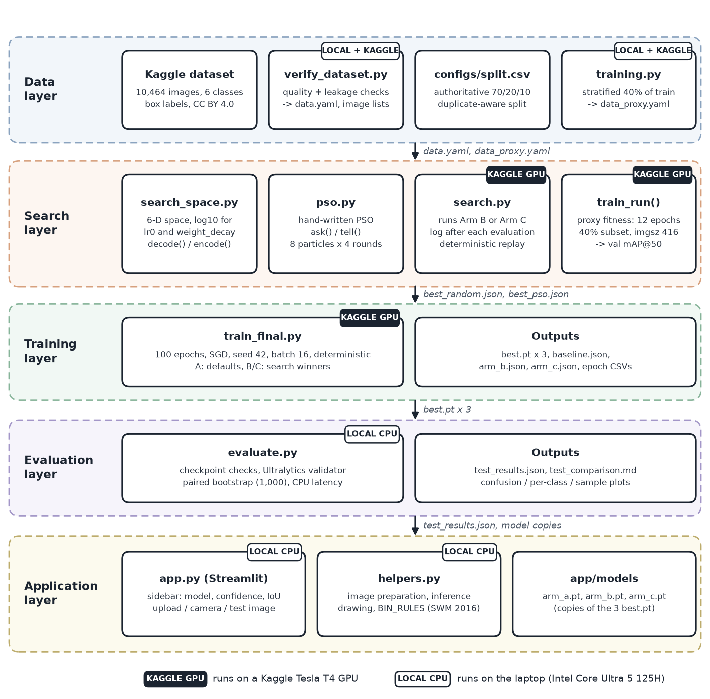
</p>

The GPU-heavy parts (baseline, proxy check, both searches, full trainings) run on Kaggle Tesla T4 notebooks. The dataset check, the final evaluation and the demo app run on a laptop CPU.

## Results

### The search

On the proxy, both searches beat the defaults. The PSO swarm converged as theory predicts: the mean fitness per round rose from 0.393 to 0.482 while the spread shrank. Random search found its best point on its second sample and never improved after that; 28 of its 32 samples scored below the defaults.

| | A: Defaults | B: Random search | C: PSO |
|---|---|---|---|
| Proxy val mAP@50 | 0.4765 | **0.4995** | 0.4953 |
| `lr0` | 0.01 | 0.00702571 | 0.00315345 |
| `lrf` | 0.01 | 0.0625491 | 0.0751247 |
| `momentum` | 0.937 | 0.911507 | 0.949322 |
| `weight_decay` | 0.0005 | 0.000602262 | 0.000259703 |
| `mosaic` | 1.0 | 0.51297 | 0.271828 |
| `scale` | 0.5 | 0.346979 | 0.470742 |
| Search time (Tesla T4) | none | 2.12 h | 1.91 h |

<p align="center">
  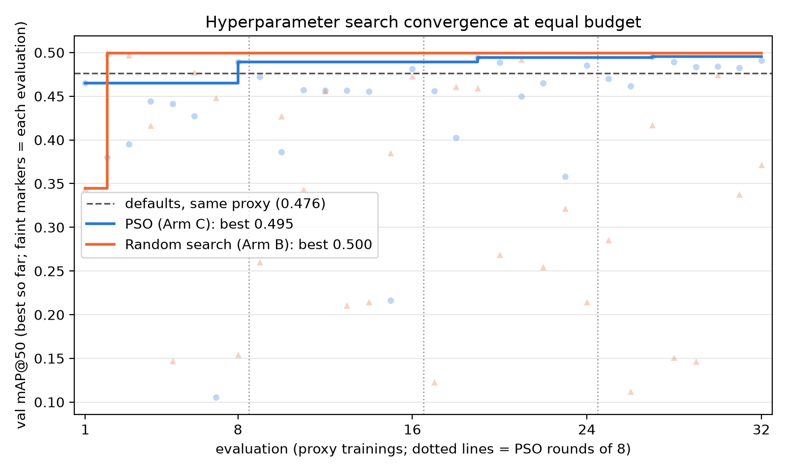
</p>

### Full training

After 100 epochs, the three models reach nearly the same validation score. B and C pull ahead early in training, but all three end on the same plateau.

| Arm | val mAP@50 | val mAP@50-95 | Training time (Tesla T4) |
|---|---|---|---|
| A: Defaults | 0.657 | 0.462 | 1.18 h |
| B: Random search | 0.643 | 0.458 | 1.15 h |
| C: PSO | 0.657 | 0.463 | 1.45 h |

<p align="center">
  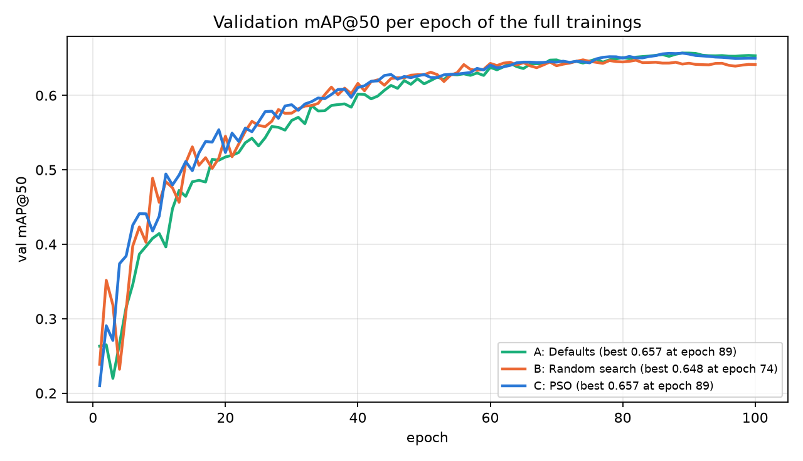
</p>

### Final test comparison

1,046 test images, 7,415 boxes. 95% CIs from 1,000 paired bootstrap resamples. Latency is the median batch-1 time at imgsz 416 on a laptop CPU (Intel Core Ultra 5 125H). Full tables: [results/test_comparison.md](results/test_comparison.md).

| Arm | test mAP@50 [95% CI] | test mAP@50-95 [95% CI] | Precision | Recall | ms/img |
|---|---|---|---|---|---|
| A: Defaults | **0.676** [0.639, 0.722] | 0.474 [0.441, 0.518] | 0.747 | 0.581 | 31.4 |
| B: Random search | 0.672 [0.634, 0.717] | 0.475 [0.441, 0.519] | 0.746 | 0.587 | 38.3 |
| C: PSO | 0.668 [0.627, 0.717] | 0.471 [0.437, 0.516] | 0.747 | 0.586 | 31.7 |

| Pair | Δ mAP@50 [95% CI] | Δ mAP@50-95 [95% CI] | Verdict |
|---|---|---|---|
| B − A | −0.004 [−0.016, +0.009] | +0.001 [−0.008, +0.010] | not significant |
| C − A | −0.008 [−0.021, +0.007] | −0.003 [−0.012, +0.007] | not significant |
| C − B | −0.004 [−0.015, +0.007] | −0.003 [−0.011, +0.004] | not significant |

Every difference interval contains 0, so this test split cannot tell the three arms apart.

<p align="center">
  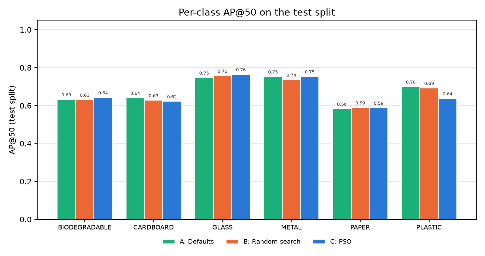
</p>

Per class, PSO's model is slightly better on BIODEGRADABLE (0.643) and GLASS (0.765) and clearly worse on PLASTIC (0.638, against 0.699 for A). The gains and losses roughly cancel out. Sample detections of all three models: [results/plots/test_samples.jpg](results/plots/test_samples.jpg).

### What we learned

- **It is a tie.** Defaults, random search and PSO are statistically indistinguishable on the untouched test split. The honest conclusion is that Ultralytics' defaults were already near-optimal for this model and dataset.
- **PSO worked as an optimizer.** It passed the benchmark checks, its swarm converged, and it found configurations that beat the defaults on a validated proxy. It just had very little room to improve on.
- **The proxy gap.** The proxy ranked very different configurations almost perfectly (ρ = 0.976), but the top candidates differed by only about 0.02 mAP@50 on it (0.4765 to 0.4995). A short run on 40% of the data rewards fast learners, and that advantage fades over 100 epochs. Random search's winner is the clearest case: the best proxy score in the project, yet a full-training val mAP@50 below the defaults (0.643 against 0.657).
- **A negative result, reported as it is.** Equal budgets, one fixed training recipe, a test split used once and a paired bootstrap are what make this conclusion trustworthy.

### Inference speed

All three models run in real time on a laptop CPU: 31.4 ms (A), 38.3 ms (B) and 31.7 ms (C) per image, or 31.8, 26.1 and 31.5 images per second. The three networks have the same architecture, so B's higher figure most likely reflects other processes running on the laptop during the measurement.

## Demo app

<p align="center">
  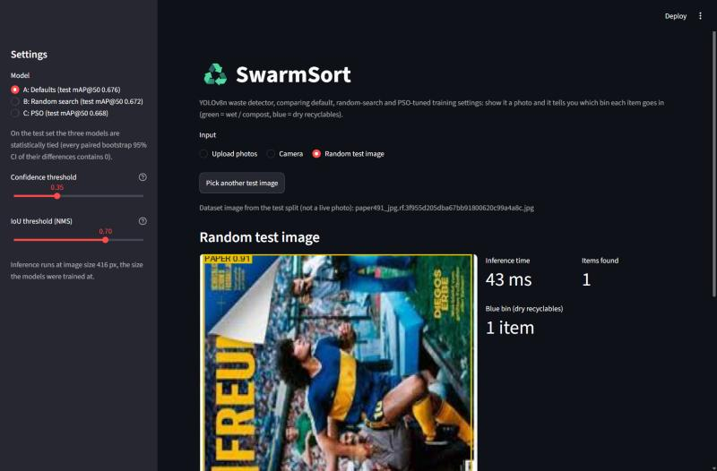
</p>

```bash
.venv/Scripts/python -m streamlit run app/app.py
```

The Streamlit app opens in the browser. It works from a fresh clone, because the three trained models are committed in [app/models/](app/models/).

**Features**

- **Input:** upload one or more photos (JPG, PNG, WebP), take one with the camera, or pick a random test-split image (when the dataset is present locally).
- **Detection:** runs the selected YOLOv8n model at imgsz 416; a laptop CPU is enough.
- **Output:** a box and a "CLASS 0.87"-style label for every item, the inference time, a table of items with their bin and a disposal tip, and the number of items per bin.
- **Box colours:** green for biodegradable items; the dry types use colours that are neither green nor blue, so a box colour is never mistaken for a bin colour.
- **Sidebar:** choose the model (A, B or C), the confidence threshold (default 0.35) and the NMS IoU threshold (default 0.7).
- **Default model:** A, the one with the highest test mAP@50. Since the three are tied, the choice makes no measurable difference.

**Bin rules** follow the colour coding of India's Solid Waste Management Rules, 2016 (`BIN_RULES` in [app/helpers.py](app/helpers.py)):

| Item | Bin | Disposal tip |
|---|---|---|
| BIODEGRADABLE | Green bin (wet / compost) | Compost |
| PAPER | Blue bin (dry recyclables) | Paper recycling; keep it dry and clean |
| CARDBOARD | Blue bin (dry recyclables) | Paper recycling; flatten boxes |
| PLASTIC | Blue bin (dry recyclables) | Plastic recycling; rinse containers |
| METAL | Blue bin (dry recyclables) | Metal recycling; rinse cans |
| GLASS | Blue bin (dry recyclables) | Glass recycling; handle with care, keep separate if broken |

<details>
<summary>How the app processes a photo</summary>

<p align="center">
  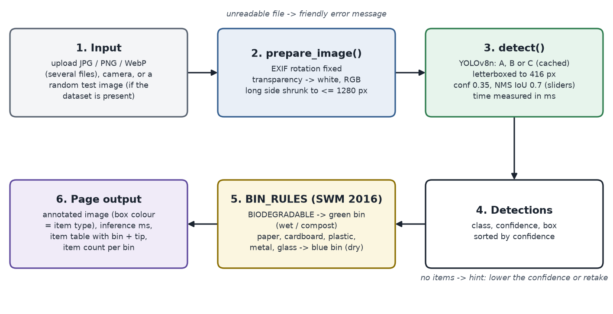
</p>
</details>

## Repository structure

```
SwarmSort/
├── app/
│   ├── app.py               Streamlit demo app
│   ├── helpers.py           image preparation, inference, drawing, BIN_RULES
│   └── models/              arm_a.pt, arm_b.pt, arm_c.pt: the three trained models (+ checksums)
├── configs/
│   └── split.csv            the authoritative 70/20/10 duplicate-aware split
├── docs/images/             diagrams and screenshots used in this README
├── notebooks/               Kaggle GPU notebooks for Phases 2, 4 and 5
├── results/
│   ├── dataset_report.json  split statistics and dataset quality checks
│   ├── baseline.json        Arm A full training (val metrics, settings)
│   ├── proxy_check.json     proxy-validity check (rho 0.976)
│   ├── search_pso.json      every PSO evaluation; best_pso.json is the winner
│   ├── search_random.json   every random-search evaluation; best_random.json is the winner
│   ├── arm_b.json, arm_c.json   full trainings of the two winners (+ *_epochs.csv curves)
│   ├── test_results.json    final test metrics, bootstrap CIs, pairwise differences, speed
│   ├── test_comparison.md   the final report tables
│   └── plots/               convergence, training curves, per-class AP, confusion, samples
├── src/
│   ├── verify_dataset.py    Phase 1: dataset checks, re-split, data.yaml
│   ├── training.py          shared training helpers; builds the stratified 40% proxy subset
│   ├── train_final.py       one full 100-epoch training (Arm A, or a search winner); --resume continues last.pt
│   ├── proxy_check.py       Phase 2: does the proxy rank like a longer training?
│   ├── search_space.py      the 6-D search space (bounds, log scale, encode/decode)
│   ├── pso.py               the hand-written PSO (ask/tell)
│   ├── pso_benchmark.py     PSO check on Sphere and Rastrigin
│   ├── search.py            Phase 4: one search arm (PSO or random), resumable
│   ├── watchdog_run.py      Kaggle freeze protection: stall watchdog with retry, local dataset copy
│   ├── plot_search.py       convergence plot of both arms
│   └── evaluate.py          Phase 5: final test evaluation with paired bootstrap
├── tests/                   unit tests (PSO, search, evaluation, plotting, app)
└── requirements.txt
```

## Quick start

```bash
git clone https://github.com/Shreyansh303/SwarmSort.git
cd SwarmSort
python -m venv .venv
.venv/Scripts/python -m pip install -r requirements.txt     # on Linux/macOS: .venv/bin/python

.venv/Scripts/python -m streamlit run app/app.py             # the demo (no dataset needed)
.venv/Scripts/python -m unittest discover -s tests -v        # the tests (one 1-minute CPU training if the dataset is present; SWARMSORT_SKIP_SLOW=1 skips it)
```

The demo needs no dataset or GPU. The "random test image" input appears only when the dataset is present locally (see Phase 1 below).

## Reproducing the experiment

The project runs in six phases. GPU work runs in the Kaggle notebooks in [notebooks/](notebooks/); everything else runs locally.

<p align="center">
  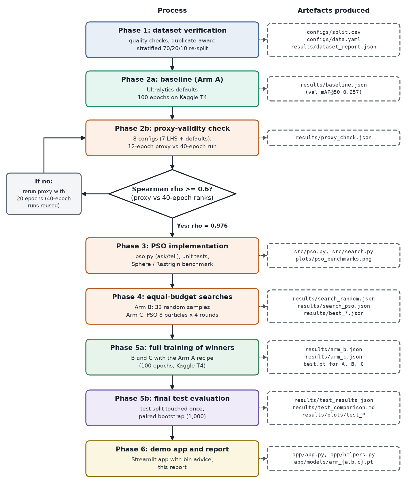
</p>

**Kaggle settings for every notebook:** Accelerator GPU T4 x2 (use the same accelerator in every phase), Internet on, the dataset `viswaprakash1990/garbage-detection` attached. Start each notebook with **Save Version → Save & Run All** so it keeps running with the browser closed. Each notebook clones this repository, installs the pinned Ultralytics version and rebuilds `configs/data.yaml` from the committed `configs/split.csv`.

<details>
<summary><b>Phase 1: dataset verification</b> (local)</summary>

Download the dataset from Kaggle and extract it into the project folder (it is git-ignored). Then:

```bash
.venv/Scripts/python src/verify_dataset.py --root "GARBAGE CLASSIFICATION"
```

This reuses `configs/split.csv`, runs the quality checks and writes:

- `configs/data.yaml` and `configs/lists/`: the Ultralytics dataset config for this machine
- `results/dataset_report.json`: split statistics and check results
- `results/plots/label_check/`: label-visualisation grids and near-duplicate pairs

On Kaggle, `--root /kaggle/input` finds the dataset folder automatically. The split file is read from the `--configs` directory (default `configs/`). If it is missing, the default `--split auto` stops with an error instead of falling back to the dataset's own folders; `--split provided` checks those folders on purpose, and `--split new` regenerates the split.

`configs/split.csv` is authoritative. Near-duplicate detection depends on the Pillow version and its resize filter, so regenerating the split on another machine can group images differently. Always reuse the committed file; do not run `--split new` on Kaggle.
</details>

<details>
<summary><b>Phase 2: baseline (Arm A) and proxy-validity check</b> (Kaggle)</summary>

Notebooks: `phase2a_baseline.ipynb` (about 1 hour) and `phase2b_proxy_check.ipynb` (about 3 hours). They run:

```bash
.venv/Scripts/python src/train_final.py   # Arm A: defaults, 100 epochs -> results/baseline.json
.venv/Scripts/python src/training.py      # stratified 40% train subset -> configs/data_proxy.yaml
.venv/Scripts/python src/proxy_check.py   # -> results/proxy_check.json
```

The proxy check trains 7 Latin-hypercube configurations plus the defaults twice each (12-epoch proxy on the 40% subset, 40-epoch run on the full train split) and accepts the proxy if the Spearman correlation of their val mAP@50 is at least 0.6. With 8 points this is a practical check, not a significance test, so the p-value is reported too. If it fails, rerun with `--proxy-epochs 20`; the 40-epoch runs are reused.

The log is saved after every finished run and a restart skips finished runs, so a dropped session loses at most one run. `--smoke` runs a tiny CPU version of the pipeline and writes to `results/smoke_*.json` instead of the real results.

Bring back: `results/baseline.json`, `results/baseline_epochs.csv`, `results/proxy_check.json`.
</details>

<details>
<summary><b>Phase 3: PSO implementation and checks</b> (local)</summary>

```bash
.venv/Scripts/python src/pso_benchmark.py                   # Sphere and Rastrigin -> results/plots/pso_benchmarks.png
.venv/Scripts/python -m unittest discover -s tests -v       # PSO and search tests (no training)
.venv/Scripts/python src/search.py --method pso --smoke     # tiny CPU pipeline check -> results/smoke_search_pso.json
```

The benchmark runs the PSO on 6-D Sphere and Rastrigin (20 particles × 50 rounds, 10 seeds) and plots the best value found so far.
</details>

<details>
<summary><b>Phase 4: the two searches</b> (Kaggle)</summary>

Notebooks (each is 32 proxy trainings, about 2 to 2.5 hours; they can run at the same time in separate sessions):

- `phase4a_pso_search.ipynb`: Arm C, `src/search.py --method pso` (8 particles × 4 rounds, seed 42)
- `phase4b_random_search.ipynb`: Arm B, `src/search.py --method random` (32 uniform samples, seed 123)

The fitness of a configuration is the val mAP@50 of one proxy training with exactly the proxy-check settings (40% subset, 12 epochs, imgsz 416). If the proxy check had escalated, `--proxy-epochs 20` would be passed. Every evaluation goes to `results/search_<method>.json` and the best one to `results/best_<method>.json`, which `src/train_final.py --config` accepts.

The log is saved after every evaluation. A restart replays the algorithm from its seed, reuses the logged results and continues with the first missing evaluation; a log made with other settings is refused. If a session dies, attach the failed version's output (**Add Input → Notebook Output**) and run the notebook again: it loses at most one proxy training.

Bring back: `results/search_pso.json`, `results/best_pso.json`, `results/search_random.json`, `results/best_random.json`. Then plot both arms:

```bash
.venv/Scripts/python src/plot_search.py   # -> results/plots/search_convergence.png and a summary table
```
</details>

<details>
<summary><b>Phase 5: full training of the winners and the test evaluation</b> (Kaggle, then local)</summary>

The two winners are trained with exactly the Arm A recipe. Notebooks (about 1.2 hours each; they can run at the same time):

- `phase5a_train_arm_b.ipynb`: `src/train_final.py --config results/best_random.json --name arm_b --out results/arm_b.json`
- `phase5b_train_arm_c.ipynb`: `src/train_final.py --config results/best_pso.json --name arm_c --out results/arm_c.json`

If a session dies, simply run it again: it is one deterministic training. From each finished version's Output tab, download (`X` is `b` or `c`):

- `results/arm_X.json` and `results/arm_X_epochs.csv` → local `results/`
- `arm_X_best.pt` (at the top of `/kaggle/working`) → local `results/runs/arm_X/weights/best.pt`

A `.pt` file downloads as a `.zip`, because a torch checkpoint is itself a zip archive. Rename it to `best.pt`; do not unzip it. Arm A's model goes to `results/runs/baseline/weights/best.pt`.

Then run the final evaluation locally:

```bash
.venv/Scripts/python src/evaluate.py   # A, B and C on the test split
```

It checks each checkpoint against `results/baseline.json`, `best_random.json` or `best_pso.json` (so a model in the wrong slot is refused), validates it with Ultralytics' validator (conf 0.001, IoU 0.7, the `max_det` stored in the checkpoint), measures the median batch-1 latency over 100 images and runs the paired bootstrap (1,000 resamples). It writes:

- `results/test_results.json`: all numbers (metrics, per-class AP, confusion matrices, speed, bootstrap CIs, pairwise differences)
- `results/test_comparison.md`: the report tables (also printed)
- `results/plots/test_confusion.png`, `test_per_class.png`, `test_samples.jpg` and `training_curves.png`

The test split is meant to be scored exactly once. For any trial run use `--split val` with a scratch `--out-dir`, so `results/` keeps only the final test outputs.
</details>

<details>
<summary><b>Phase 6: demo app</b> (local)</summary>

```bash
.venv/Scripts/python -m streamlit run app/app.py
```

The weights in `app/models/` (`arm_a.pt`, `arm_b.pt`, `arm_c.pt`) are byte copies of the three trained models in `results/runs/*/weights/best.pt`; [app/models/README.md](app/models/README.md) lists their sources and checksums. `tests/test_app.py` tests the bin rules, the image handling and a headless run of the app.
</details>

## Generation 2

Everything above is Generation 1. Its models work on clean, studio-style photos but get confused by real street scenes, so Generation 2 changes the data rather than the tuning.

- **Goal:** detect and sort waste in normal places (streets, parks, homes), and report studio and real-world accuracy separately.
- **Data:** a merged dataset of 6,292 train, 1,841 val and 1,514 test images at 640 px, from three sources: a subsample of the Gen 1 dataset (studio), TACO and HITL Recycling (real-world litter). There are 7 classes: Gen 1's six plus OTHER. DWSD photos from Kolkata (700 images) form a separate, test-only India set.
- **Method:** the same three arms as Gen 1 (A defaults, B random search, C PSO, 32 proxy trainings each), then 100 epochs of full training at imgsz 640 on Kaggle.
- **Status:** finished (test evaluation done 2026-10-10).

Test mAP@50 [95% CI], test split used once:

| Arm | all (1,514 images) | studio (1,046) | real_world (468) | india (700) |
|---|---|---|---|---|
| A: Defaults | 0.479 [0.453, 0.513] | 0.571 [0.529, 0.619] | 0.310 [0.278, 0.440] | 0.027 [0.024, 0.031] |
| B: Random search | 0.497 [0.471, 0.531] | 0.595 [0.557, 0.639] | 0.298 [0.271, 0.407] | 0.023 [0.021, 0.027] |
| C: PSO | 0.500 [0.474, 0.534] | 0.590 [0.550, 0.635] | 0.310 [0.279, 0.415] | 0.027 [0.024, 0.031] |

**Verdict.** Unlike Gen 1, tuning now helps: on the all and studio splits, both random search and PSO are significantly better than the defaults (about +0.02 mAP@50, paired bootstrap), but PSO and random search are again a statistical tie. On real-world photos no difference is significant, and on the Indian DWSD photos all three models fail (about 0.02–0.03), mainly because there was no Indian training data and DWSD's mask-derived boxes merge touching items.

These numbers cannot be compared with Gen 1's 0.676: the studio images are the same, but Gen 2 uses 7 classes instead of 6, 640 px instead of 416 and only 3,000 of the 7,324 Gen 1 training images. Whether Gen 2 beats Gen 1 on real-world photos is not measured yet (next step: score the Gen 1 models on the Gen 2 real_world test set).

Full history, problems and decisions: [docs/EVOLUTION.md](docs/EVOLUTION.md). How to run it on Kaggle: [notebooks/gen2/README.md](notebooks/gen2/README.md).

## Limitations and future work

- **One seed per arm.** Each arm was trained once (seed 42). Run-to-run noise was not measured and may be as large as the differences between arms. Next step: 3 to 5 seeds per arm.
- **Short proxy.** The 12-epoch, 40% proxy favours fast learners. A longer proxy or multi-fidelity methods (successive halving, Hyperband) could separate the top candidates better.
- **Small search.** 32 evaluations in 6 dimensions. Larger swarms, more rounds, more hyperparameters and PSO variants (ring topology, constriction factor) are natural extensions.
- **One dataset.** The images are mostly product-style photos on clean backgrounds; real household and street scenes may behave differently.
- **Deployment.** Export to ONNX or TensorFlow Lite to run on a phone or an edge device beside a bin.

## References and acknowledgements

1. S. Majchrowska et al., "Deep learning-based waste detection in natural and urban environments," *Waste Management*, vol. 138, pp. 274–284, 2022. (Base paper.)
2. J. Kennedy and R. Eberhart, "Particle swarm optimization," *Proc. IEEE ICNN*, 1995.
3. Y. Shi and R. Eberhart, "A modified particle swarm optimizer," *Proc. IEEE Int. Conf. Evolutionary Computation*, 1998.
4. J. Bergstra and Y. Bengio, "Random search for hyper-parameter optimization," *JMLR*, vol. 13, pp. 281–305, 2012.
5. G. Jocher, A. Chaurasia and J. Qiu, "Ultralytics YOLOv8," 2023. https://github.com/ultralytics/ultralytics
6. B. Efron and R. J. Tibshirani, *An Introduction to the Bootstrap*, Chapman & Hall, 1993.
7. Ministry of Environment, Forest and Climate Change, Government of India, "Solid Waste Management Rules, 2016."

**Dataset:** [Garbage Detection – 6 Waste Categories](https://www.kaggle.com/datasets/viswaprakash1990/garbage-detection) by viswaprakash1990 on Kaggle, licensed under CC BY 4.0. The images are used unmodified; the project only adds its own split file.

**Software:** [Ultralytics YOLOv8](https://github.com/ultralytics/ultralytics) for the detector and its training and validation tools, Streamlit for the demo, and Kaggle for the free GPU time.

## Author

**Shreyansh Jain** ([@Shreyansh303](https://github.com/Shreyansh303))
Soft Computing course project, Semester V (Unit V: swarm intelligence).
